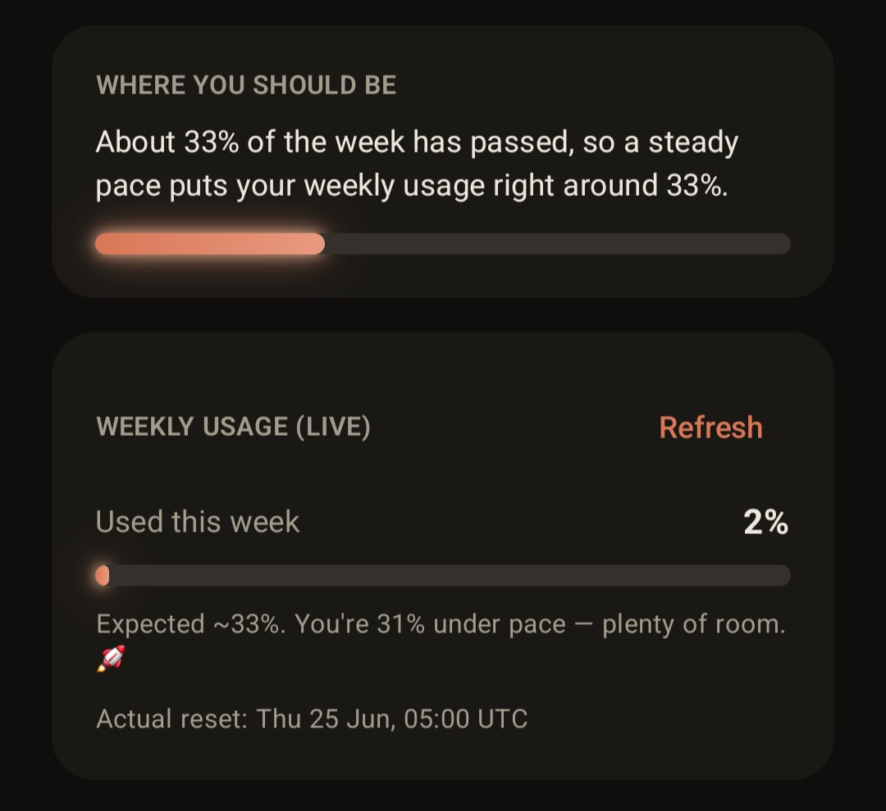
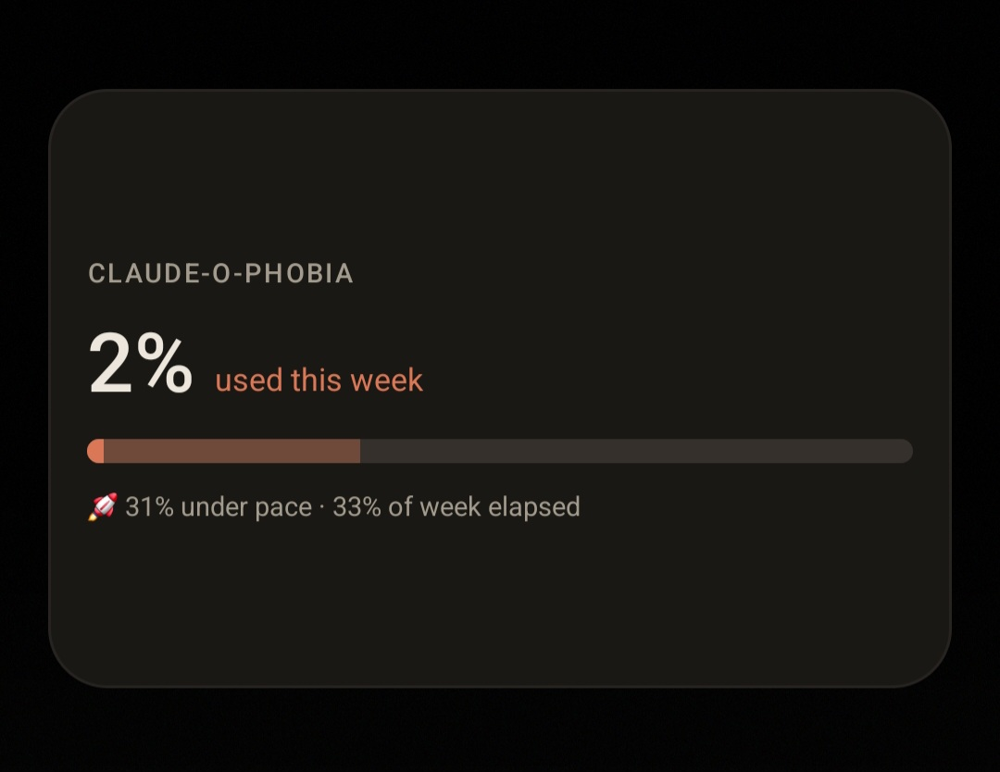

# Claude-o-phobia ⏳

<p align="center"><em>An elegant Android app that counts down to your weekly Claude limit reset — because waiting for that fresh week of usage is the best kind of anticipation. 🧡</em></p>

## Gallery

<p align="center"><em>Home screen</em></p>



<p align="center"><em>Widget</em></p>



## Features

- **🕑 Live countdown** to the next weekly reset, inside a ring that fills up as
  the week elapses.
- **🔋 Percentage of the week elapsed**, so you know roughly where a steady,
  evenly-paced usage level *should* be right now.
- **📊 Live usage** stats which show how much of your **weekly limit** you've used vs. the expected pace.
- **🖥 A home-screen widget** — a glance-able card with the weekly percentage and
  a glowing progress bar.
- **🎯 A widget pacing cue** (toggleable in Settings) — a faint "where you should
  be" marker on the widget's bar at the point you've reached in the week, plus a
  line telling you whether your live usage is *ahead of* or *under* that pace.
  

## Installing

Grab the latest APK from [the Releases tab](https://github.com/Xiddoc/Claude-o-phobia/releases), and install it.

## Building

Requires the Android SDK (compileSdk 35) and JDK 17.

```bash
./gradlew assembleDebug      # build the debug APK
./gradlew testDebugUnitTest  # run unit tests
```

The APK lands in `app/build/outputs/apk/debug/`.

---

Made with care (and Claude). Thanks for everything. 🧡
